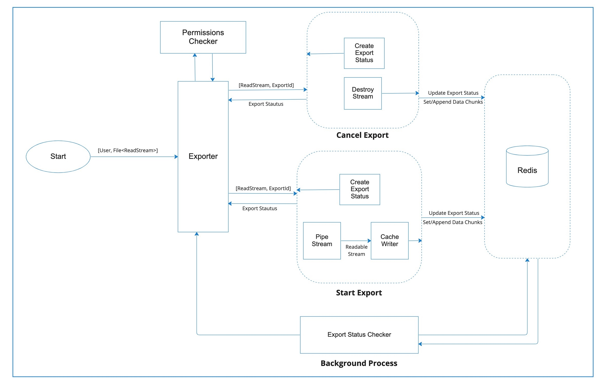

# Heartbeat engineering challenge


## Tasks

### Task 1

#### Architecture Diagram


***Main Components***
- Exporter
   > An interface exposing the main features of the exporter module i.e `startExport`, `getExportStatus` and `cancelExport`,

- Permissions Checker
   > An access control layer for checking the permissions of the user (`permissions.ts`) \
   Throws an error if the user does not have the necessary permissions

- Start Export
   > A group of operations and processes the start the export process of the input file (ReadStream) \
   Pipes the file stream to the Cache Writer (`newCacheWriter`) \
   The Cache Writer writes the data chunks and export status to the Redis Cache \
   Returns the export status

- Cancel Export
   > Cancels the export process by destroying the file ReadStream (`readsteam.destroy()`) \
   Updates the cached export status to `CANCELLED` \
   expires the cached data \
   Returns the export status 

- Background Process
   > Checks the status of the exported file at an interval of 500ms \
   Logs the export status to the console
   


### Task 2a 🛠

See the implementation of `CancelExport` in the [exporter module](./src/exporter.ts).

### Task 3 📈
---
#### Possible Improvements

***Code Modularity***
   > We can further break down the two main modules `index.ts` and `exporter.ts` into specialized components of interfaces, functions and processes. \
   For instance, the function `newCacheWriter` can be exported and used in the `exporter.ts` module.
   ```ts
   // services/newCacheWriter.ts

   import ...
  
   export function newCacheWriter(exportId: string, cache: RedisClient) {
      const append = util.promisify(cache.APPEND).bind(cache);
      const set = util.promisify(cache.SET).bind(cache);
      const expire = util.promisify(cache.EXPIRE).bind(cache);

      return new Writable({
         async write(chunk, _, callback) {
            await append(exportId + "-data", chunk.toString("binary"));
            await set(exportId, JSON.stringify({ status: "PENDING", id: exportId }));
            callback();
         },
         async final(callback) {
            await set(exportId, JSON.stringify({ status: "COMPLETE", id: exportId }));
            await expire(exportId, 60 * 60);
            await expire(exportId + "-data", 60 * 60);
            callback();
         },
      });
   }
   ```

***DRY***
   > Repeated cache functions like `get`, `set` `append`, and `expire` exported from a DAO that interacts. with the cache

   ```ts
   // dao/cache.ts

   import ...

   const get = util.promisify(cache.GET).bind(cache);
   const set = util.promisify(cache.SET).bind(cache);
   const append = util.promisify(cache.APPEND).bind(cache);
   const expire = util.promisify(cache.EXPIRE).bind(cache);
   
   export {
      get,
      set,
      append,
      expire
   }
   ```
   > We can create a constant the holds all the export statuses

   ```ts
   // constants/exportStatus.ts

   export const exportStatus = {
      CREATED: 'CREATED',
      COMPLETE: 'COMPLETE',
      PENDING: 'PENDING',
      CANCELLED: 'CANCELLED',
      ...
   }
   ```

***Infinite Loop***
> We can use `setInterval` instead of the infinite while loop for performance reasons. \
`setInterval` is a Node.js timer that is preferred for our use-case where we need a background process (like a cron-job) for checking the export status.

```ts
// index.ts

...

setInterval(async () => {
   const res = await exporter.GetExportStatus(MockUUIDGen.NewUUID())
   console.log(res)
}, 500);
```

**Tips**

1. We are looking for ideas such as patterns, principles and performance.
2. You don't need to implement any improvements, but feel free to use code
   examples where you feel it would be helpful.


## Start the application

Run the example with:

```shell
yarn start
```

Format code:

```shell
yarn format
```
